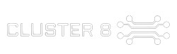

# Sumário

* [Introdução](#introducao)
* [Meus Projetos](#projetos)
* * [Primeiro Semestre](#em-2020-2)
* * [Segundo Semestre](#em-2021-1)
* * [Terceiro Semestre](#em-2021-2)
* * [Quarto Semestre](#em-2022-1)
* * [Quinto Semestre](#em-2022-2)
* [Meus Principais Conhecimentos](#conhecimentos)
* [Contato](#contato)

# Jonathan Gabriel 

## Introdução

  

    
  

   

  
Estudante do 5º Semestre de Análise e Desenvolvimento de Sistemas na <a href="https://fatecsjc-prd.azurewebsites.net/">FATEC Prof. Jessen Vidal</a>, em São José dos Campos - SP.
  

### Formação

- Ensino Médio - E.E. Prof. Dorival Monteiro de Oliveira, em 2016.

### Experiências Profissionais

- Operador de Caixa - Em uma rede de Supermercados de Atacado, entre o período de 03/2020 á 09/2021.
- Atualmente estagiando na área de tecnologia na <a href="https://tecsus.com.br/">TecSUS Tecnologias para a Sustentabilidade</a>, uma Startup do Parque Tecnológico de São José dos Campos - SP.

# Meus Projetos 

Os projetos realizados foram feitos com base no método <a href="https://fatecsjc-prd.azurewebsites.net/aprendizagem-por-projetos-integrados.php">API (Aprendizagem por Projetos Integrados)</a>, desenvolvida no escopo do <a href="https://fatecsjc-prd.azurewebsites.net/cadi.php">CADI</a>, é a metodologia de ensino em implantação na Fatec São José dos Campos.
## Em 2020-2 (Primeiro Semestre) 

  
  <h3>Elite Academy</h3>

### Parceiro Acadêmico

No API do Primeiro Semestre (2020-2), o parceiro acadêmico foi a FATEC Prof. Jessen Vidal, tendo como papel de empresa no projeto, o Prof. Antonio Egydio.

### Visão do Projeto

O cliente deseja um site e-commerce para venda de conteúdos acadêmicos voltados para a área de _Análise e Desenvolvimento de Sistemas_, desde livros em PDF a video aulas, onde os conteúdos inseridos fossem gerenciados pelo ADM do site. 

Como solução para o cliente, foi desenvolvido o site **Elite Academy** onde é possível efetuar a adição dos conteúdos ao carrinho de compras, finalizar a compra destes conteúdos acadêmicos, as consultas de saldo de crédito, o cadastro de usuário e cadastro de conteúdo acadêmico.

  
  
  <strong> Prévia da solução Elite Academy</strong>

### Github do Projeto

 

### Tecnologias Utilizadas

-  

  Linguagem de marcação utilizada na construção das páginas;

- 

  Linguagem de estilização utilizada para o uso de estilos;

- 

  Provedor de hospedagem do site criado e estilização.

### Contribuições Pessoais

Contribui com a criação de conteúdos acadêmicos para o armazenamento no site e participação na tomada de decisões sobre os levantamentos de requisitos do projeto e MVP.

### Hard Skills

- HTML - Sei fazer com ajuda;
- CSS - Sei fazer com ajuda;
- WordPress: Sei fazer com ajuda.

### Soft Skills

- Empatia - Para entender a necessidade do cliente, onde o foco seja na análise e na resolução do problema.
 
  A equipe necessitava de maiores detalhes sobre o desafio proposto pela empresa, neste momento auxiliei na análise de levantamentos de requisitos, para que o cliente estivesse de acordo com as próximas entregas das Sprint's.

- Colaboração - Comprometimento com as atividades distribuídas afim de ajudar com a demanda da equipe.

  Como a equipe possuía necessidade da criação dos conteúdos ao quais seriam vendidos pelo nosso site, auxiliei na criação destes contéudos acadêmicos para popular a loja do site.

## Em 2021-1 (Segundo Semestre) 

### Parceiro Acadêmico

No API do Segundo Semestre (2021-1), a empresa parceira foi a <a href="https://www.gsw.com.br/">GSW Soluções Integradas</a>, sendo o nosso cliente do projeto.

### Visão do Projeto

O cliente deseja uma aplicação voltada em análise de dados dos seus projetos em andamento, onde deverá unificar estes dados em uma dashboard, utilizando e gerenciando o tratamento destes dados de seus projetos (JIRA e Trello), para que assim a diretoria possa fazer o uso e gerenciamento de seus projetos.

Como solução para o cliente, foi desenvolvido a **DashW** uma aplicação onde é possível visualizar os projetos com suas respectivas tarefas em uma Dashboard, de maneira simples é fácil, tendo a sessão de colaboradores onde é possível visualizar as horas gastas nos projetos e a sessão de Kanban Board que poderá visualizar os dados de suas tarefas do projeto selecionado em formato de Kanban.

  
  
<strong> Prévia da solução da Equipe Evolution</strong>

### Github do Projeto

 

### Tecnologias Utilizadas

- 
  
  Utilizado para o Back-end da aplicação, onde o Node tem por foco no desenvolvimento próximo ao servidor;

- 

  Utilizado pela versatilidade e ganho em performance na utilização de um ecossistema _JavaScript_, sendo assim uma maior segurança e eficácia na tipagem dos dados;

- 

  Utilizado como framework para o Front-end, por possuir uma maior praticidade em utilizar a componentização e o uso de estados globais.

### Contribuições Pessoais

Contribui com a prototipagem das telas no <a href="https://www.figma.com/proto/G5w97oD5RsC9l6Ndg5hXot/Evolution?node-id=400%3A20&scaling=scale-down&page-id=0%3A1">Figma</a>, auxiliei no levantamento dos requisitos do projeto e contribuição na tomada de decisões sobre o MVP das entregas.

### Hard Skills

- Node.JS - Sei fazer com autonomia;
- TypeScript - Sei fazer com ajuda;
- React - Sei fazer;
- Figma - Sei fazer com autonomia.

### Soft Skills

- Empatia - Para entender a necessidade do cliente, onde o foco seja na análise e na resolução do problema.
 
  A equipe necessitava de mais informações sobre a resolução de certos problemas que foram apresentados pelo cliente, neste momento auxiliei na análise de levantamentos de requisitos, para que o cliente estivesse de acordo com os casos de uso apresentados e a resolução dos problemas propostos.

- Trabalho em equipe - Para a divisão de tarefas que sejam realizadas e entregues no prazo.

  Devido as diferentes fontes de dados (JIRA e Trello), foi necessário a cooperação e trabalho em equipe para que fosse realizado a unificação e tratamento destes dados.

## Em 2021-2 (Terceiro Semestre) 

  

 

### Parceiro Acadêmico

No API do Terceiro Semestre (2021-2), a empresa parceira foi a <a href="https://pt-br.ionic.health/">IonicHealth</a>, sendo o nosso cliente do projeto.

### Visão do Projeto

O cliente deseja uma aplicação Web de CRM (Customer Relationship Management) voltada na organização e gerenciamento de seus clientes, oferecendo suporte adequado às áreas de vendas e negócios para as empresas parceiras.

Como solução para o cliente, foi desenvolvido o **TARGET - Business Solutions** uma aplicação Web onde é possível realizar o cadastro, gestão de Pipelines e negociações, organizar e editar os contatos dos clientes, realizar o monitoramento e acompanhamento de clientes, recebimento de e-mails para novos contatos, efetuar a importação de arquivos com contatos e visualizar as negociações em uma Dashboard.

  
  
<strong> Prévia da solução da Equipe Cluster 8</strong>

### Github do Projeto

 

### Tecnologias Utilizadas

- 
  
  Utilizado para o Back-end da aplicação, onde o Node tem por foco no desenvolvimento próximo ao servidor;

- 

  Utilizado pela versatilidade e ganho em performance na utilização de um ecossistema _JavaScript_, sendo assim uma maior segurança e eficácia na tipagem dos dados;

- 

  Utilizado como framework para o Front-end, por possuir uma maior praticidade em utilizar a componentização e o uso de estados globais;

-  

  Linguagem de marcação utilizada na construção das páginas;

- 

  Linguagem de estilização utilizada para o uso de estilos;

- 

  Utilizado no gerencimanto do banco de dados relacional da aplicação.

### Contribuições Pessoais

Contribui com a prototipagem das telas no <a href="https://www.figma.com/proto/9Wjemyb5Fc0einoBG4pciU/API---cluster8?node-id=217%3A1296&scaling=contain&page-id=0%3A1&starting-point-node-id=217%3A1296">Figma</a>, auxiliei no levantamento dos requisitos do projeto, ajudei no desenvolvimento da tela de contatos e logout do usuário.

### Hard Skills

- Node.JS - Sei fazer com autonomia;
- TypeScript - Sei fazer com ajuda;
- React - Sei fazer;
- HTML5 - Sei fazer;
- CSS3 - Sei fazer;
- PostgreSQl - Sei fazer com ajuda;
- Figma - Sei fazer com autonomia.

### Soft Skills

- Trabalho em equipe - Para a divisão de tarefas que sejam realizadas e entregues no prazo.

  Devido a demanda de atividades foi necessário em alguns momentos o _pair programming_, para que se pudesse obter um ganho na produtividade em tarefas que levariam um maior tempo de execução.
