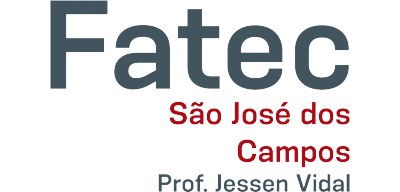

# Sumário  

* [Introdução](#introducao)
* [Meus Projetos](#projetos)
* * [Primeiro Semestre](#em-2020-2)
* * [Segundo Semestre](#em-2021-1)
* * [Terceiro Semestre](#em-2021-2)
* * [Quarto Semestre](#em-2022-1)
* * [Quinto Semestre](#em-2022-2)
* * [Sexto Semestre](#em-2023-1)
* [Meus Principais Conhecimentos](#conhecimentos)
* [Contato](#contato)

# Jonathan Gabriel 

## Introdução

  

    
  

   

  
Estudante do 6º Semestre de Análise e Desenvolvimento de Sistemas na <a href="https://fatecsjc-prd.azurewebsites.net/">Fatec Prof. Jessen Vidal</a>, em São José dos Campos - SP.
  

### Formação

- Ensino Médio - E.E. Prof. Dorival Monteiro de Oliveira, em 2016.

### Experiências Profissionais

- Operador de Caixa - Em uma rede de Supermercados de Atacado, entre o período de 03/2020 á 09/2021.
- Atualmente estagiando na área de tecnologia na <a href="https://tecsus.com.br/">TecSUS Tecnologias para a Sustentabilidade</a>, uma Startup do Parque Tecnológico de São José dos Campos - SP.

# Meus Projetos 

Os projetos realizados foram feitos com base no método <a href="https://fatecsjc-prd.azurewebsites.net/aprendizagem-por-projetos-integrados.php">API (Aprendizagem por Projetos Integrados)</a>, desenvolvida no escopo do <a href="https://fatecsjc-prd.azurewebsites.net/cadi.php">CADI</a>, é a metodologia de ensino em implantação na Fatec Prof. Jessen Vidal, em São José dos Campos.

  

## Em 2020-2 (Primeiro Semestre) 

  
  <h3>Elite Academy</h3>

### Parceiro Acadêmico

No API do Primeiro Semestre (2020-2), o parceiro acadêmico foi a <a href="https://fatecsjc-prd.azurewebsites.net/">FATEC Prof. Jessen Vidal</a> que pertence ao <a href="https://www.cps.sp.gov.br/">Centro Paula Souza</a>, oferecendo cursos de graduação para formar tecnólogos. Neste projeto, o Prof. Antonio Egydio teve o papel de empresa na realização do API.

### Visão do Projeto

O cliente deseja um site e-commerce para venda de conteúdos acadêmicos voltados para a área de _Análise e Desenvolvimento de Sistemas_, desde livros em PDF a video aulas, onde os conteúdos inseridos fossem gerenciados pelo ADM do site. 

Como solução para o cliente, foi desenvolvido o site **Elite Academy** onde é possível efetuar a adição dos conteúdos ao carrinho de compras, finalizar a compra destes conteúdos acadêmicos, as consultas de saldo de crédito, o cadastro de usuário e cadastro de conteúdo acadêmico.

  
  
<strong> Prévia da solução Elite Academy</strong>

### Github do Projeto

 

### Tecnologias Utilizadas

-  

  Linguagem de marcação utilizada na construção das páginas;

- 

  Linguagem de estilização utilizada para o uso de estilos;

- 

  Provedor de hospedagem do site criado e estilização.

### Contribuições Pessoais

Contribui com a criação de conteúdos acadêmicos para o armazenamento no site e participação na tomada de decisões sobre os levantamentos de requisitos do projeto e MVP.

### Hard Skills

- HTML - Sei fazer com ajuda;
- CSS - Sei fazer com ajuda;
- WordPress: Sei fazer com ajuda.

### Soft Skills

- Empatia - Para entender a necessidade do cliente, onde o foco seja na análise e na resolução do problema.
 
  A equipe necessitava de maiores detalhes sobre o desafio proposto pela empresa, neste momento auxiliei na análise de levantamentos de requisitos, para que o cliente estivesse de acordo com as próximas entregas das Sprint's.

- Colaboração - Comprometimento com as atividades distribuídas afim de ajudar com a demanda da equipe.

  Como a equipe possuía necessidade da criação dos conteúdos ao quais seriam vendidos pelo nosso site, auxiliei na criação destes contéudos acadêmicos para popular a loja do site.

## Em 2021-1 (Segundo Semestre) 

### Parceiro Acadêmico

No API do Segundo Semestre (2021-1), a empresa parceira foi a <a href="https://www.gsw.com.br/">GSW Soluções Integradas</a>, uma empresa especializada em desenvolvimento e implantação de soluções inteligentes em Tecnologia da Informação para gestão empresarial, gestão tributária, operações em comércio exterior e CRM (Customer Relationship Management).

Atuando desde 1991, com mais de 30 anos de experiência em projetos globais de TI e mais de 500 colaboradores espalhados por 6 unidades no Brasil, a GSW oferece um portfólio abrangente, construído através de sólidas alianças com empresas de soluções globais em TI, como a Thomson Reuters, SAP e Microsoft.

A GSW tem maturidade para atender praticamente todas as demandas de seus clientes, desde desenvolvimento de software, implantação de ERP e sistemas satélites, até alocação de profissionais técnicos e funcionais.

### Visão do Projeto

O cliente deseja uma aplicação voltada em análise de dados dos seus projetos em andamento, onde deverá unificar estes dados em uma dashboard, utilizando e gerenciando o tratamento destes dados de seus projetos (JIRA e Trello), para que assim a diretoria possa fazer o uso e gerenciamento de seus projetos.

Como solução para o cliente, foi desenvolvido a **DashW** uma aplicação onde é possível visualizar os projetos com suas respectivas tarefas em uma Dashboard, de maneira simples é fácil, tendo a sessão de colaboradores onde é possível visualizar as horas gastas nos projetos e a sessão de Kanban Board que poderá visualizar os dados de suas tarefas do projeto selecionado em formato de Kanban.

  
  
<strong> Prévia da solução da Equipe Evolution</strong>

### Github do Projeto

 

### Tecnologias Utilizadas

- 
  
  Utilizado para o Back-end da aplicação, onde o Node tem por foco no desenvolvimento próximo ao servidor;

- 

  Utilizado pela versatilidade e ganho em performance na utilização de um ecossistema _JavaScript_, sendo assim uma maior segurança e eficácia na tipagem dos dados;

- 

  Utilizado como framework para o Front-end, por possuir uma maior praticidade em utilizar a componentização e o uso de estados globais.

### Contribuições Pessoais

Contribui com a prototipagem das telas no <a href="https://www.figma.com/proto/G5w97oD5RsC9l6Ndg5hXot/Evolution?node-id=400%3A20&scaling=scale-down&page-id=0%3A1">Figma</a>, auxiliei no levantamento dos requisitos do projeto e contribuição na tomada de decisões sobre o MVP das entregas.

### Hard Skills

- Node.JS - Sei fazer com autonomia;
- TypeScript - Sei fazer com ajuda;
- React - Sei fazer;
- Figma - Sei fazer com autonomia.

### Soft Skills

- Empatia - Para entender a necessidade do cliente, onde o foco seja na análise e na resolução do problema.
 
  A equipe necessitava de mais informações sobre a resolução de certos problemas que foram apresentados pelo cliente, neste momento auxiliei na análise de levantamentos de requisitos, para que o cliente estivesse de acordo com os casos de uso apresentados e a resolução dos problemas propostos.

- Trabalho em equipe - Para a divisão de tarefas que sejam realizadas e entregues no prazo.

  Devido as diferentes fontes de dados (JIRA e Trello), foi necessário a cooperação e trabalho em equipe para que fosse realizado a unificação e tratamento destes dados.

## Em 2021-2 (Terceiro Semestre) 

  

 

### Parceiro Acadêmico

No API do Terceiro Semestre (2021-2), a empresa parceira foi a <a href="https://pt-br.ionic.health/">IonicHealth</a>.

Sobre a <a href="https://pt-br.ionic.health/sobre">tragetoria de nosso cliente</a>:

Em 1991, a empresa NESS Technology nasceu com foco na inovação e transformação, entregando resultados com rapidez e segurança. Assim como o mundo e a tecnologia, ao longo dos anos, a empresa também passou por constantes transformações.

Em 2017, suas três principais verticais de operação: saúde, jurídica e segurança começaram a seguir seus próprios caminhos.

E de um spin off em 2019, nasceu a NESS Health, que entra na discussão da inovação e transformação digital no campo da medicina diagnóstica, bem como o desejo de contribuir para a melhoria da saúde e trazer maior eficiência à Jornada Digital do Paciente.

Mas as mudanças não pararam, exigindo não apenas mais avanços tecnológicos, mas também um posicionamento mais proeminente.

Tinha chegado o momento de nossa própria identidade, baseada nos princípios que norteiam nosso campo. Incorporar em nossa história um elemento que trouxesse à tona e fosse capaz de realmente se conectar com nossa essência.

E foi quando, em 2021, nasceu a IONIC Saúde.

### Visão do Projeto

O cliente deseja uma aplicação Web de CRM (Customer Relationship Management) voltada na organização e gerenciamento de seus clientes, oferecendo suporte adequado às áreas de vendas e negócios para as empresas parceiras.

Como solução para o cliente, foi desenvolvido o **TARGET - Business Solutions** uma aplicação Web onde é possível realizar o cadastro, gestão de Pipelines e negociações, organizar e editar os contatos dos clientes, realizar o monitoramento e acompanhamento de clientes, recebimento de e-mails para novos contatos, efetuar a importação de arquivos com contatos e visualizar as negociações em uma Dashboard.

  
  
<strong> Prévia da solução da Equipe Cluster 8</strong>

### Github do Projeto

 

### Tecnologias Utilizadas

- 
  
  Utilizado para o Back-end da aplicação, onde o Node tem por foco no desenvolvimento próximo ao servidor;

- 

  Utilizado pela versatilidade e ganho em performance na utilização de um ecossistema _JavaScript_, sendo assim uma maior segurança e eficácia na tipagem dos dados;

- 

  Utilizado como framework para o Front-end, por possuir uma maior praticidade em utilizar a componentização e o uso de estados globais;

-  

  Linguagem de marcação utilizada na construção das páginas;

- 

  Linguagem de estilização utilizada para o uso de estilos;

- 

  Utilizado no gerencimanto do banco de dados relacional da aplicação.

### Contribuições Pessoais

Contribui com a prototipagem das telas no <a href="https://www.figma.com/proto/9Wjemyb5Fc0einoBG4pciU/API---cluster8?node-id=217%3A1296&scaling=contain&page-id=0%3A1&starting-point-node-id=217%3A1296">Figma</a>, auxiliei no levantamento dos requisitos do projeto, ajudei no desenvolvimento da tela de contatos e logout do usuário.

### Hard Skills

- Node.JS - Sei fazer com autonomia;
- TypeScript - Sei fazer com ajuda;
- React - Sei fazer;
- HTML5 - Sei fazer;
- CSS3 - Sei fazer;
- PostgreSQl - Sei fazer com ajuda;
- Figma - Sei fazer com autonomia.

### Soft Skills

- Trabalho em equipe - Para a divisão de tarefas que sejam realizadas e entregues no prazo.

  Devido a demanda de atividades foi necessário em alguns momentos o _pair programming_, para que se pudesse obter um ganho na produtividade em tarefas que levariam um maior tempo de execução.

## Em 2022-1 (Quarto Semestre) 

  

 

### Parceiro Acadêmico

No API do Quarto Semestre (2022-1), a empresa parceira foi a <a href="https://www.visionaespacial.com.br/">Visiona</a>, sendo o nosso cliente do projeto.

A <a href="https://www.visionaespacial.com.br/">Visiona</a> Tecnologia Espacial é uma joint-venture entre a Embraer Defesa & Segurança e a Telebras, voltada para a integração de sistemas espaciais. Criada em 2012 para atender os objetivos do Programa Nacional de Atividades Espaciais (PNAE) e do Programa Estratégico de Sistemas Espaciais (PESE). A empresa foi a responsável pelo Programa do Satélite Geoestacionário de Defesa e Comunicações Estratégicas, o SGDC, lançado em 2017. Em 2018, a Visiona anunciou o programa do primeiro satélite projetado integralmente pela indústria nacional, o VCUB1, e concluiu com êxito o primeiro Sistema de Controle de Órbita e Atitude de satélites desenvolvido no Brasil.

A Visiona também fornece produtos e serviços de Sensoriamento Remoto e Telecomunicações por satélite, bem como Aerolevantamento SAR nas Bandas X e P..

### Visão do Projeto

O cliente deseja uma aplicação Mobile colaborativa para produtores rurais de Soja, voltada na análise, gerenciamento de sua propriedade e produtividade de seus talhões agrícolas. Onde ele possa visualizar suas fazendas e talhões no mapa, o preço da saca da soja de sua região, custo de produção (adubo, sementes, fertilizantes e agrotóxicos) e o período de chuva.

Como solução para o cliente, foi desenvolvido o **Sr. Soja** uma aplicação Mobile, onde o produtor rural poderá realizar o cadastro de suas fazendas e talhões através da API do Google Maps, utilizando a latitude e longitude no registro, a gestão de sua produtividade fazendo previsões de "produtividade" e adição de sua "produtividade real", a análise de custos de produção de adubos, sementes, fertilizantes e agrotóxicos, a possibilidade de consulta no preço da saca de soja de sua região para uma melhor análise de possíveis vendas de sua produção de soja, consulta do período de chuva de sua região para evitar desperdícios do uso de agrotóxicos e histórico de compras e vendas dos produtos.

  
  
  
<strong> Prévia da solução da Equipe NeroJet</strong>

### Github do Projeto

### Tecnologias Utilizadas

- 

  Utilizado pela versatilidade e praticidade no desenvolvimento híbrido para aplicações mobile.

- 

  Tecnologia principal do desenvolvimento, utilizada para a estruturação do servidor/Back-end (NodeJS) e as funcionalidades do Front-end (React Native).

- 
  
  Utilizado para o Back-end da aplicação, onde o Node tem por foco no desenvolvimento próximo ao servidor;

- 

  Utilizado no gerencimanto do banco de dados relacional da aplicação, pelo suporte nativo ao JSON onde facilita no desenvolvimento.

- 

  Utilizado para a criação de um banco de dados imbutido, assim possibilitando o funcionamento offline de um aplicativo mobile.

### Contribuições Pessoais

No projeto _Sr. Soja_ tive o papel de Scrum Master, contribui com a prototipagem das telas no <a href="https://www.figma.com/proto/BhRWFNZ6F9ecpPeyetIxIa/Sr.Soja?node-id=0%3A1&scaling=scale-down&starting-point-node-id=1068%3A3299&show-proto-sidebar=1">Figma</a>, auxiliei no levantamento dos requisitos do projeto e criação do <a href="https://github.com/Jonathan-Assis/API-4-SrSoja-2022-1/tree/main/Refer%C3%AAncias/Der" >DER</a>, fiz a estruturação dos arquivos, rotas/navegação das telas do mobile, criação da página de cadastro da fazenda e talhão onde houve a utilização da API do <a href="https://viacep.com.br/"> ViaCEP</a> e do <a href="https://developers.google.com/maps">Google Maps</a> tendo a opção de informar o local através do CEP ou a seleção pelo mapa utilizando o marcador que irá gerar a latitude e longitude e efetuei a reversão destas coordenadas para exibição do local selecionado, efetuei a criação da página de relatórios de produtividade onde é possível visualizar a fazenda e talhão cadastrados, poder também efetuar a "previsão" de produtividade do talhão e a adição da "colheita" realizada, criei a página de cotação da soja onde o produtor poderá visualizar os valores da saca de 60kg de sua região ou de outras.

### Hard Skills

- Node.JS - Sei fazer com autonomia;
- React Native - Sei fazer com autonomia;
- PostgreSQl - Sei fazer com ajuda;
- SQLite - Sei fazer com ajuda;
- Figma - Sei fazer com autonomia.

### Soft Skills

- Liderança - Análise e separação das tarefas referente os requisitos propostos no projeto.

  Neste projeto tive o papel de _Scrum master_, onde efetuei a análise dos requisitos e conhecimentos da equipe para um melhor aproveitamento de tempo em execução das tarefas que posteriormente foram repassadas, afim de chegarmos ao produto final o mais próximo esperado pelo cliente devido a demanda de tempo ser menor.

- Autodidatismo - Buscar e aprender sobre o uso de APIs de geolocalização, para a criação da funcionalidade de localização do projeto.

  Devido a necessidade do projeto de utilizar a localização por meio de coordenadas, aprofundei nas pesquisas sobre o uso da latitude e longitude com a API do Google Maps e a reversão dessas coordenadas (Latitude e Longitude) para uma localização legível, tendo como segunda opção no cadastro da fazenda o uso da API do ViaCEP onde é necessário apenas informar o CEP para realizar a consulta do local. 

- Empatia - Para entender as necessidades do cliente, e apontar possíveis propostas para seu produto.
 
  Devido a demanda de tempo ser menor, foi necessário oferecer alternativas ao cliente, respeitando os limites propostos nos requisitos, para assim executarmos as principais necessidades da aplicação.

- Flexibilidade - Para atender as mudanças ocorridas no sprint backlog.

  Devido o projeto passar por mudanças, foi necessário a adaptação aos requisitos propostos afim de realizar as entregas previstas.

- Proatividade - Tomada de iniciativa na execução de tarefas propostas no backlog.

  Devido a equipe possuir o primeiro contato em aplicação mobile, tive a iniciativa de continuar as tarefas pendentes afim de concluir os requisitos propostos para a entrega da Sprint.

## Em 2022-2 (Quinto Semestre) 

  
  
<strong>Ocorrências Públicas (OP)</strong>

 

### Parceiro Acadêmico

No API do Quinto Semestre (2022-2), o parceiro acadêmico foi a <a href="https://fatecsjc-prd.azurewebsites.net/">FATEC Prof. Jessen Vidal</a>, que pertence ao <a href="https://www.cps.sp.gov.br/">Centro Paula Souza</a>, oferecendo cursos de graduação para formar tecnólogos. Neste projeto, o Prof. Gerson da Penha teve o papel de cliente na realização do API.

### Visão do Projeto

O cliente deseja uma aplicação mobile para coleta de dados públicos, de acordo com o conceito _citizens sensors_, para auxílio da **secretaria de obras e serviço público**.

Como solução para o cliente, foi desenvolvido o **Ocorrências Públicas (OP)** uma aplicação Mobile, onde o cidadão tem por objetivo reportar problemas em sua cidade, nesta aplicação ele poderá:
- Visualizar um pequeno walkthrough (_Tutorial_): O Walkthrough será utilizado para mostrar ao cidadão sobre o que é, e onde ficam as funcionalidades do **OP**, afim de tornar a primeira experiêcia com o App mais fácil e prático;

- Reportar uma ocorrência: Selecionará a categoria e subcategoria que mais se encaixam em seu problema, efetuar a adição de foto pela galeria ou tirando uma foto com a câmera, poderá selecionar no mapa a localização do ocorrido ou selecionando a própria localização atual e informará em detalhes sobre o acontecimento;

- Visualizar as ocorrências: O cidadão poderá visualizar as próprias ocorrências ou de todos através do mapa, onde possuirá filtros para as categorias, e poderá visualizar na lista de cards todas as ocorrências ativas e para visualizar todos os detalhes de uma ocorrência, basta selecionar o marcador ou clicar no card;

- Editar os dados cadastrais: O cidadão poderá editar as informações do perfil como CPF, senha, adicionar uma foto de perfil ou deletar permanentemente a conta.

  
  
  
<strong> Prévia da solução da Equipe Nox</strong>

### Github do Projeto

### Tecnologias Utilizadas

- 

  Utilizado pela versatilidade e praticidade no desenvolvimento híbrido para aplicações mobile.

- 

  Tecnologia principal do desenvolvimento, utilizada para a estruturação do servidor/Back-end (NodeJS) e as funcionalidades do Front-end (React Native).

- 

  Utilizado para o Back-end da aplicação, onde o Node tem por foco no desenvolvimento próximo ao servidor.

- 

  Banco de Dados não relacional, utilizado para armazenar os dados da aplicação em JSON.

### Contribuições Pessoais

Auxiliei no levantamento dos requisitos do projeto, fiz a estruturação dos arquivos, rotas/navegação das telas do mobile, criação do contexto de autenticação e salvamento do local storage, criei a página de login, reportar ocorrência com a possibilidade de inserção de foto com a câmera ou da galeria, seleção da localização da ocorrência a ser reportada através do mapa utilizando a API do <a href="https://developers.google.com/maps">Google Maps</a>, criação da tela de chamados com o uso das localizações registradas e a exibição dos marcadores filtrados no mapa com a API do <a href="https://developers.google.com/maps">Google Maps</a>, criação da página de opções e edição de perfil,  

### Hard Skills

- Node.JS - Sei fazer com autonomia;
- React Native - Sei fazer com autonomia;
- PostgreSQl - Sei fazer com ajuda;
- SQLite - Sei fazer com ajuda;
- Figma - Sei fazer com autonomia.

### Soft Skills

- Autodidatismo - Buscar e aprender sobre melhorias no uso da API do Google Maps, para melhor aproveitamento de seu uso.

  Devido a necessidade do projeto de utilizar a localização por meio de coordenadas, procurei melhorias na exibição no quesito UX & UI. 

- Criatividade - Para entender as necessidades do cliente, e apontar possíveis melhorias para seu produto.
 
  Com as principais entregas do backlog concluídas, apontei melhorias ao produto para um melhor aproveitamento da aplicação, como o walkthrough para que o usuário sempre se familiarize melhor com a aplicação, exibição dos marcadores do mapa separado por cores para indicação de categorias diferentes e mudança do tamanho de escala destes marcadores para facilitar a visualização caso tenha ocorrências muito próximas uma das outras.

- Flexibilidade - Para atender as mudanças ocorridas no sprint backlog.

  Devido o projeto passar por mudanças, foi necessário a adaptação aos requisitos propostos afim de realizar as entregas previstas.

- Proatividade - Tomada de iniciativa na execução de tarefas propostas no backlog.

  Devido ao projeto passado com o uso de geolocalização, tomei iniciativa pela experiência na utilização da API do Google Maps para efetuar o uso nas página de criação da ocorrência e exibição dos marcadores pela tela de chamados.

## Em 2023-1 (Sexto Semestre) 

  

 

### Parceiro Acadêmico

No API do Sexto Semestre (2023-1), a empresa parceira foi uma instituição de serviços financeiros, sendo o nosso cliente do projeto.

### Visão do Projeto

O cliente deseja uma ferramenta de comparação de preços de tarifas de serviços bancários oferecidos pelas intituições financeiras, utilizando os dados disponibilizados pelo **Open Finance**.

O **Open Finance** ou **Sistema Financeiro Aberto** é uma iniciativa do Banco Central do Brasil que tem como principais objetivos trazer inovação ao sistema financeiro, promover a concorrência, e melhorar a oferta de produtos e serviços financeiros.

Como solução para o cliente, foi desenvolvido o **SeeTax**, uma aplicação web onde é possível visualizar pelos paineis da Dashboard a comparação, os indicadores e previsões de tarifas dos serviços bancários disponibilizados pelo **Open Finance** do Banco Central do Brasil.

<!-- 

  
  
<strong> Prévia da solução da Equipe Nox</strong>

 -->

### Github do Projeto

### Tecnologias Utilizadas

- 

  Framework de Javascript, utilizado no Front-end da aplicação;

- 

  Utilizado pela versatilidade e ganho em performance na utilização de um ecossistema _JavaScript_, sendo assim uma maior segurança e eficácia na tipagem dos dados;  

- 
  
  Framework do Java, utilizado no Back-end da aplicação;

- 

  Linguagem de progamação orientada a objetos (POO), utilizada no Back-end da aplicação;

- 

  Linguagem de programação de alto nível, utilizada no desenvolvimento da IA para treinamento e previsão dos dados.

### Contribuições Pessoais

No projeto _SeeTax_ tive o papel de desenvolvedor (Dev Team), contribui com a prototipagem das telas no <a href="">Figma</a>, desenvolvimento do <a href="https://github.com/Jonathan-Assis/API6-SeeTax-FrontEnd">Front-end</a> da aplicação, fiz a estruturação dos arquivos, as rotas/navegação das telas da aplicação, criação das páginas de Dashboard e tarifas, efetuei a criação de components para facilitar no desenvolvimento e reaproveitamento de funcionalidade, separação da base de <a href="https://github.com/Jonathan-Assis/API6-SeeTax-FrontEnd/tree/main/src/assets/stylesheet">estilos organizada em variáveis e classes</a>, comunicação com o Back-end e utilização de stores com o <a href="https://pinia.vuejs.org/">Pinia</a>.

### Hard Skills

- Vue 3 - Sei fazer com autonomia;
- Typescript - Sei fazer com autonomia;
- Spring Boot - Sei fazer;
- Java - Sei fazer;
- Python - Sei fazer com autonomia;
- Figma - Sei fazer com autonomia.

### Soft Skills

- Autodidatismo - Buscar e aprender sobre o framework Vue 3 e o Pinia.

  Como requisitos solicitados pelo cliente de utilizar o Vue, busquei conhecimentos sobre o framework para utilizar-lo no projeto atual, assim como Pinia para o armazenamento local utilizando os stores.

- Flexibilidade - Para atender as mudanças ocorridas no sprint backlog.

  Houveram reajustes em algumas funcionalidades que foi necessário readaptar-las para a utilização.

- Proatividade - Tomada de iniciativa na execução de tarefas propostas no backlog.

  Organização e criação da estrutura da aplicação do Front-end, criação de indicaores e gráficos para serem exibidos na dashboard.

# Meus Principais Conhecimentos 

Possuo conhecimentos em Vue.JS, React, React Native, JavaScript, Typescript, HTML, CSS, Python, C, Firebase, Node.JS, MySQL, MongoDB, prototipagem com Figma e metodologia Scrum.

# Contato 

[⬆ Voltar ao topo](#topo)